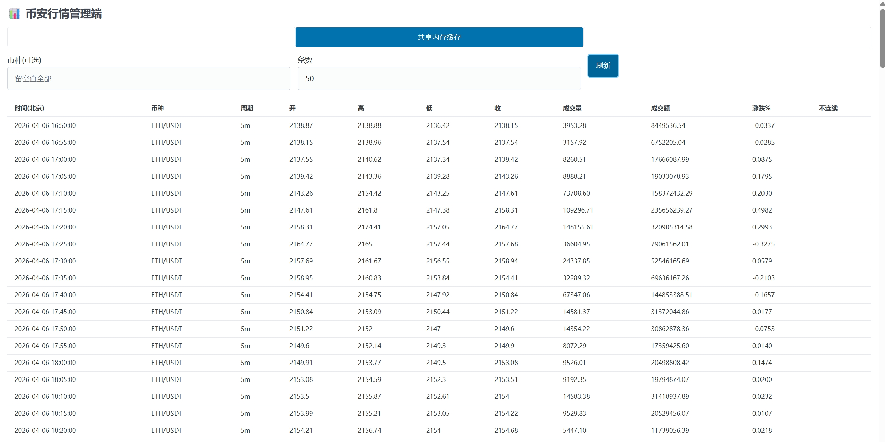
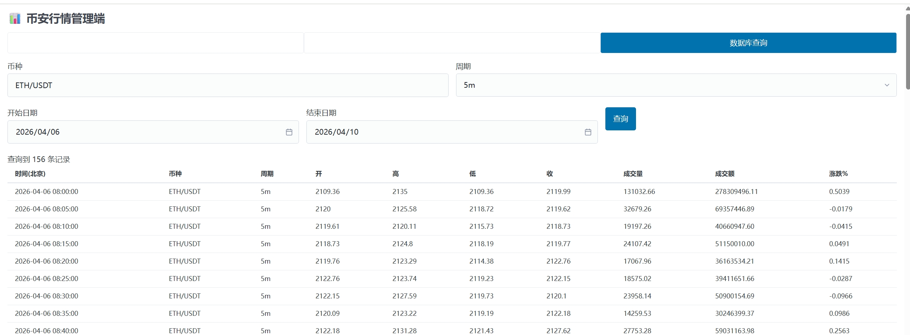
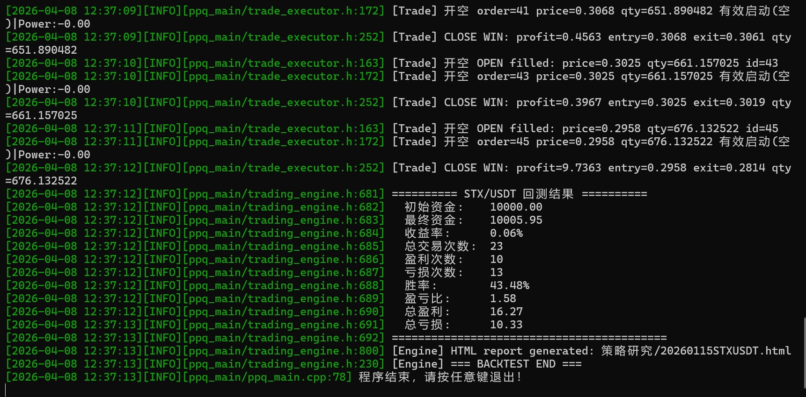
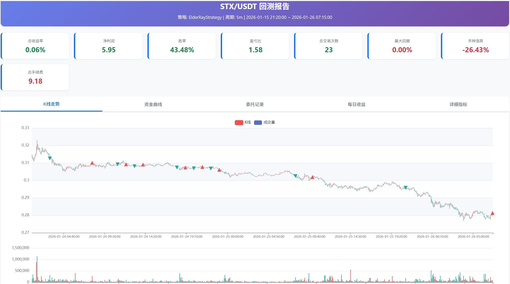
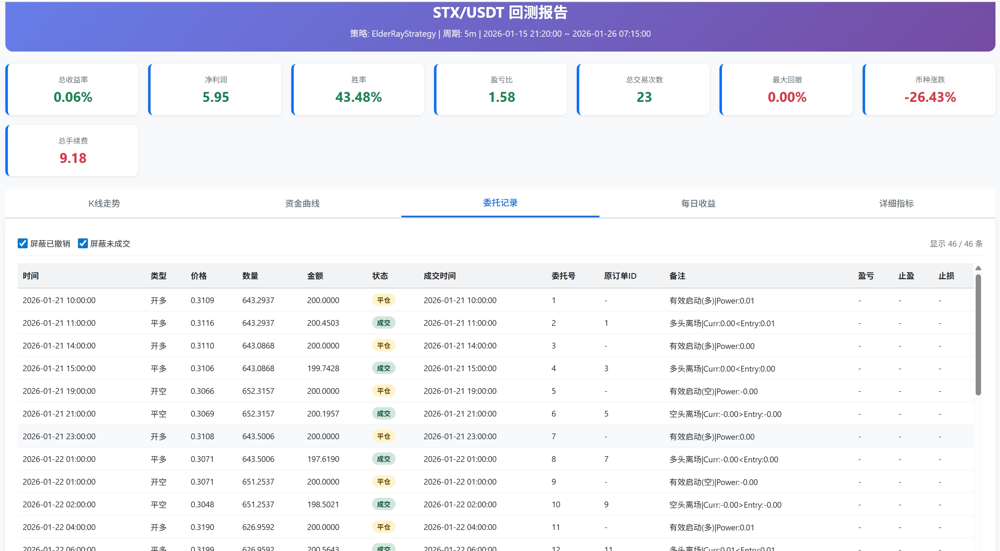
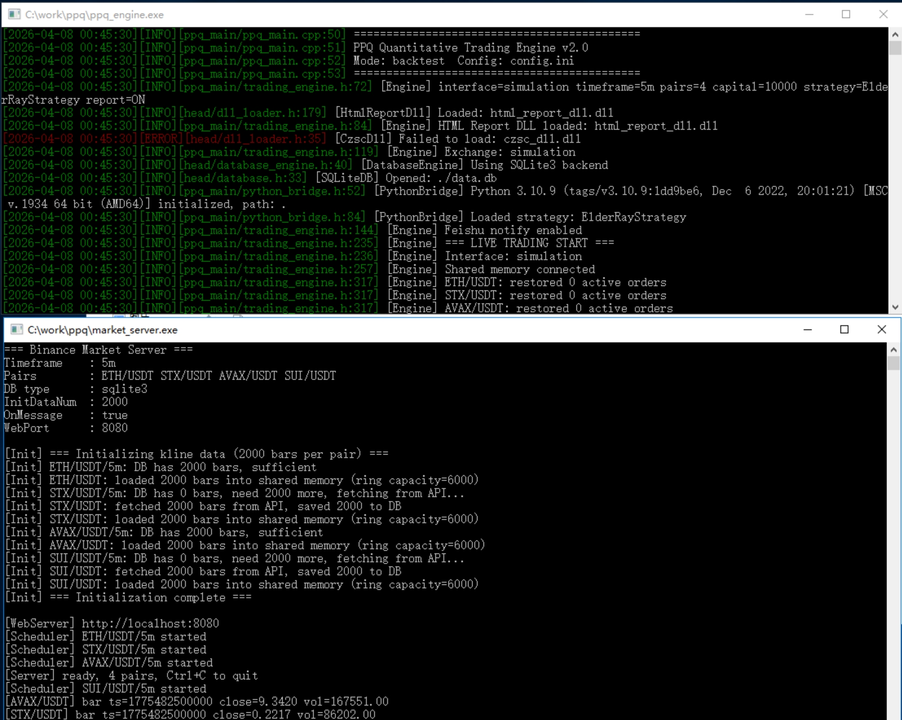

# PPQ-ENGINE
基于 C++/Python 混合编程的高性能量化交易系统  
支持回测、实盘、行情插件。Windows 支持：✅；Linux：❌（测试/开发中）。编译环境：MinGW（MSYS2 / mingw-w64）。

简要说明：PPQ 是一个以 C++ 为核心、通过 Python 策略插件快速扩展的量化系统。C++ 负责高性能的数据处理、网络、存储与交易引擎；Python 负责策略与回测脚本。目标：高吞吐、低延迟、易扩展和可移植（优先 Windows）。

**目录与模块说明**
- `bin`: 编译产物、示例脚本、配置文件拷贝目标。
- `czsc`: 基于 缠中说禅技术分析工具，主要是策略、信号、指标、工具函数（Python）引用项目：https://github.com/waditu/czsc。
- `ppq_main`: 核心引擎、策略加载器、C++ 主程序（backtest/live）以及 Python 桥接。
- `market_server`: 行情拉取服务（kline_fetcher、web 管理端、共享内存、pub/sub）。
- `html_report`: 回测 HTML 报告生成（DLL）。
- `trade`: 交易相关代码（trade_dll、Binance API Python 封装、交易脚本）。
- `head`: 公共头文件（C++ 接口、配置、数据库、日志等）。
- `third_party`: 第三方头文件/单文件库（httplib, json.hpp 等）。
- `tool`: 工具脚本（如 pg2sqlite.py）。

**核心特性**
- 回测：基于历史 K 线的事件驱动回测，支持 Python 策略插件，生成 HTML 报告。
- 实盘：连接交易所（目前支持 Binance），下单与风控由 C++ 引擎 + trade DLL 处理。
- 行情服务：独立行情拉取程序，支持定时拉取、多重重试、共享内存发布/订阅（onmessage 模式）。
- 插件化策略：Python 脚本作为策略模块，C++ 通过 Python.h 或 DLL 与之交互。
- 数据持久化：支持 SQLite 与 PostgreSQL（由 `config.ini` 指定）。
- HTML 报告：回测结果导出为 HTML（`html_report_dll`）。

**主要文件与运行入口**
- 编译目标（由 `makefile` 控制）：
	- `bin/ppq_engine.exe` — 主引擎（backtest / live）
	- `bin/market_server.exe` — 行情服务
	- `bin/trade_dll.dll` — 交易 DLL（trade 模块）
	- `bin/html_report_dll.dll` — 报告 DLL
- 配置文件：根目录 `config.ini`（示例：数据库、交易对、策略模块等）

**依赖（摘要）**
- 系统/构建：MSYS2 (MinGW-w64)、g++ (mingw-w64)、make、cmake（可选）
- C/C++ 库：libcurl、OpenSSL、sqlite3、libpq (PostgreSQL 客户端)

**MSYS2（MinGW-w64） 环境 - 安装依赖（示例）**
1. 安装 MSYS2（https://www.msys2.org/），打开 “MSYS2 MinGW 64-bit” (mingw64.exe)。
2. 更新包数据库（可能需要重启 shell）：
```bash
pacman -Syu
# 如果提示关闭并重新打开 shell，请关闭并再次运行：
pacman -Su
```
3. 安装常用编译/运行依赖（示例）：
```bash
pacman -S --needed base-devel mingw-w64-x86_64-toolchain mingw-w64-x86_64-cmake \
	mingw-w64-x86_64-python3 mingw-w64-x86_64-python3-pip \
	mingw-w64-x86_64-curl mingw-w64-x86_64-openssl mingw-w64-x86_64-sqlite3 \
	mingw-w64-x86_64-postgresql
```
说明：
- `mingw-w64-x86_64-toolchain` 包含 `g++`、`gcc` 等编译器。
- 如果你使用系统（Windows）Python 编译（Makefile 默认使用 Windows Python 路径），请确保已安装对应的 Windows Python（含 dev headers）。在 `makefile` 中设置 `PYTHON_ROOT` 为你的 Python 安装路径（见下文）。

**Python 依赖（建议）**
在 Windows 系统 Python 环境中运行：
```bash
python -m pip install --upgrade pip
pip install numpy pandas matplotlib requests websocket-client psycopg2-binary
# TA-Lib（如果需要）:
pip install TA-Lib || echo "若安装失败，请安装 TA-Lib C 库 或 使用预编译 wheel/conda"
```
可选：把这些写入 `requirements.txt` 并使用 `pip install -r requirements.txt`。

**构建（在 MSYS2 MinGW64 shell 中）**
1. 进入仓库根目录：
```bash
cd .
```
2. （可选）编辑 `makefile`，确保下列变量指向你的安装路径：
- `PYTHON_ROOT`：Windows Python 安装目录（含 `include` 和 `libs`）
- `PG_ROOT`：PostgreSQL 安装目录（含 `bin\\libpq.dll` 等）
3. 运行构建：
```bash
make
```
默认目标会创建 `bin/` 目录并构建：`ppq_engine.exe`、`market_server.exe`、`trade_dll.dll`、`html_report_dll.dll`，并尝试拷贝 Python / PostgreSQL 的 DLL 到 `bin/`。

如果需要只构建某个目标，例如仅编译行情服务：
```bash
make bin/market_server.exe
```

**运行示例**
- 运行行情服务（默认读取仓库根目录下 `config.ini`，或指定配置文件）运行之后会定时读取行情，可以web端在localhost:8080查看数据：
```bash
./bin/market_server.exe
```


- 运行引擎 — 回测，修改配置config.ini直接运行，回测完成会输出html报告：
```bash
./bin/ppq_engine.exe 
```



- 运行引擎 — 实盘：
```bash
./bin/ppq_engine.exe live -c config.ini
```

注意：
- `config.ini` 中的 `[database]` 段支持 `sqlite3`（轻量，推荐本地测试）和 `postgresql`（生产/长期存储）。
- `makefile` 的 `copy_files` 会尝试将 Python 的 DLL、Postgres 的 libpq 等拷贝到 `bin/`，确保 `PYTHON_ROOT` 与 `PG_ROOT` 设置正确，或手动将所需 DLL 复制到 `bin/`。

**配置要点（config.ini）**
- `[system].interface`：`simulation`（回测）或 `binance`（实盘）
- `[market].currency_pairs`：用逗号分隔的交易对
- `[backtest].limit` / `start_date`：回测范围
- `[database]`：`db_type` 可选 `sqlite3` 或 `postgresql`，如果使用 PostgreSQL，请配置 `db_conn`

（更多配置项请参阅 `config.ini`）

**调试与常见问题**
- 编译找不到 Python 头文件或库：检查 `PYTHON_ROOT`，或安装 MSYS2 的 `mingw-w64-x86_64-python3` 并调整 Makefile include/lib 路径。
- TA-Lib 安装失败：优先安装 C 库或使用预编译 wheel/conda。
- Windows 下运行缺少 DLL：检查 `bin/` 是否包含 `python3*.dll`、`libpq.dll`、`libssl-*.dll`、`libcrypto-*.dll`，必要时手动拷贝。
- 数据库连接失败：确认 PostgreSQL 已启动且 `db_conn` 字段正确。

**如何贡献**
- 欢迎提交 Issue 描述错误/需求。
- 如果要合并代码，请先在新分支上提交 PR，保持风格一致，写明变更。
- 对于平台兼容性改进（例如 Linux 支持），请在 Issue 中说明你的测试平台、编译链与重现步骤。

**未来计划（待完成 / 开发中）**
- 完整的 Linux 支持与 CI（当前：Windows 为首要支持平台）
- 单元测试与集成测试用例
